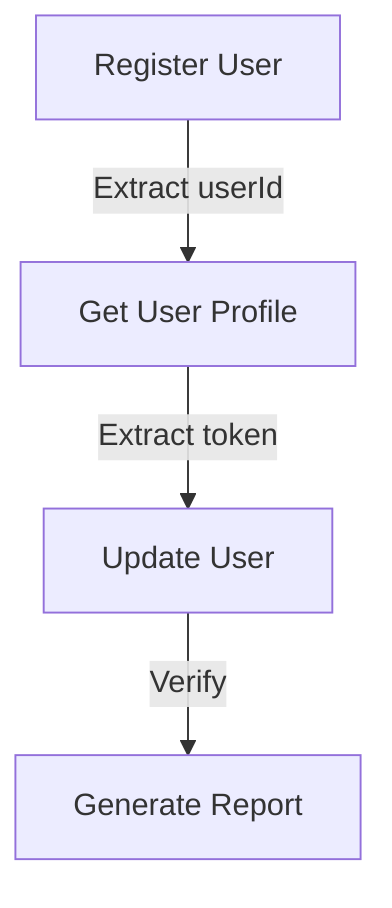

# 🚀 Quick Start Guide - ApiTesting Platform

> Get up and running with ApiTesting in minutes!

---

## 📋 Table of Contents

1. [Installation](#installation)
2. [Your First API Test](#your-first-api-test)
3. [Creating Collections](#creating-collections)
4. [Working with Environments](#working-with-environments)
5. [Data-Driven Testing](#data-driven-testing)
6. [Scheduling Tests](#scheduling-tests)
7. [Common Scenarios](#common-scenarios)

---

## Installation

### Step 1: Prerequisites
```bash
✓ Java 21+
✓ Maven 3.8+
✓ PostgreSQL 12+
✓ Git
```

### Step 2: Clone & Setup
```bash
# Clone repository
git clone <repository-url>
cd ApiTesting

# Configure database (application.properties)
spring.datasource.url=jdbc:postgresql://localhost:5432/api_testing
spring.datasource.username=postgres
spring.datasource.password=your_password

# Build
./mvnw clean package

# Run
./mvnw spring-boot:run
```

### Step 3: Verify Installation
```bash
curl http://localhost:8080/api/collections
# Expected: 200 OK with empty array []
```

---

## Your First API Test

### Method 1: Quick Test via cURL

```bash
curl -X POST http://localhost:8080/api/test \
  -H "Content-Type: application/json" \
  -d '{
    "url": "https://jsonplaceholder.typicode.com/posts/1",
    "method": "GET",
    "assertions": [
      {
        "type": "StatusCode",
        "operator": "Equals",
        "expectedValue": 200
      },
      {
        "type": "JSONPath",
        "path": "$.id",
        "operator": "Equals",
        "expectedValue": 1
      }
    ]
  }'
```

### Expected Response:
```json
{
  "status": 200,
  "statusMessage": "OK",
  "responseBody": {
    "userId": 1,
    "id": 1,
    "title": "sunt aut facere...",
    "body": "quia et suscipit..."
  },
  "responseTime": 450,
  "assertions": [
    {
      "type": "StatusCode",
      "status": "PASSED"
    },
    {
      "type": "JSONPath",
      "status": "PASSED"
    }
  ]
}
```

---

## Creating Collections

### Step 1: Create Collection

```bash
curl -X POST http://localhost:8080/api/collections \
  -H "Content-Type: application/json" \
  -d '{
    "name": "My First API Collection",
    "description": "Test collection for learning"
  }'
```

**Response**:
```json
{
  "id": "550e8400-e29b-41d4-a716-446655440000",
  "name": "My First API Collection",
  "description": "Test collection for learning",
  "createdAt": "2026-07-16T10:30:00Z"
}
```

Save the `id` for next steps.

### Step 2: Add Requests to Collection
```bash
# Use POST to add requests (see API documentation)
```

### Step 3: Execute Collection

```bash
curl -X POST http://localhost:8080/api/collection-runner/550e8400-e29b-41d4-a716-446655440000/run \
  -H "Content-Type: application/json"
```

**Response**:
```json
{
  "collectionRunId": "uuid",
  "collectionId": "550e8400-e29b-41d4-a716-446655440000",
  "totalRequests": 5,
  "passedRequests": 5,
  "failedRequests": 0,
  "executionTime": 3500,
  "status": "SUCCESS",
  "startTime": "2026-07-16T10:35:00Z",
  "endTime": "2026-07-16T10:35:03.5Z"
}
```

---

## Working with Environments

### Step 1: Create Development Environment

```bash
curl -X POST http://localhost:8080/api/environments \
  -H "Content-Type: application/json" \
  -d '{
    "name": "Development",
    "description": "Local development environment",
    "variables": {
      "base_url": "http://localhost:3000",
      "api_version": "v1",
      "timeout": "30000"
    }
  }'
```

### Step 2: Create Production Environment

```bash
curl -X POST http://localhost:8080/api/environments \
  -H "Content-Type: application/json" \
  -d '{
    "name": "Production",
    "description": "Production environment",
    "variables": {
      "base_url": "https://api.production.com",
      "api_version": "v1",
      "timeout": "60000"
    }
  }'
```

### Step 3: Use Variables in Requests

```bash
curl -X POST http://localhost:8080/api/test \
  -H "Content-Type: application/json" \
  -d '{
    "url": "{{base_url}}/api/users",
    "method": "GET",
    "headers": {
      "Accept": "application/json"
    },
    "environmentId": "env-uuid"
  }'
```

The `{{base_url}}` will be replaced with the environment variable value.

---

## Data-Driven Testing

### Step 1: Create CSV File (test-data.csv)

```csv
username,email,password,expected_status
john_doe,john@example.com,Pass123!,201
jane_smith,jane@example.com,Pass456!,201
bob_jones,bob@example.com,Pass789!,201
```

### Step 2: Create Request Template

```bash
# First, create or save a request with body:
{
  "username": "{{username}}",
  "email": "{{email}}",
  "password": "{{password}}"
}
```

### Step 3: Execute Data-Driven Test

```bash
curl -X POST http://localhost:8080/api/data-driven/request-uuid \
  -F "file=@test-data.csv" \
  -H "Content-Type: multipart/form-data"
```

**Response**:
```json
{
  "totalRows": 3,
  "successfulExecutions": 3,
  "failedExecutions": 0,
  "results": [
    {
      "rowNumber": 1,
      "variables": {
        "username": "john_doe",
        "email": "john@example.com"
      },
      "status": "PASSED",
      "responseStatus": 201
    },
    {
      "rowNumber": 2,
      "variables": {
        "username": "jane_smith",
        "email": "jane@example.com"
      },
      "status": "PASSED",
      "responseStatus": 201
    },
    {
      "rowNumber": 3,
      "variables": {
        "username": "bob_jones",
        "email": "bob@example.com"
      },
      "status": "PASSED",
      "responseStatus": 201
    }
  ]
}
```

---

## Scheduling Tests

### Step 1: Create Schedule (Daily at 9 AM)

```bash
curl -X POST http://localhost:8080/api/schedules \
  -H "Content-Type: application/json" \
  -d '{
    "name": "Daily API Health Check",
    "description": "Run collection every day at 9 AM",
    "collectionId": "collection-uuid",
    "scheduleType": "CRON",
    "cronExpression": "0 9 * * *",
    "timezone": "UTC",
    "enabled": true,
    "notifyOnSuccess": false,
    "notifyOnFailure": true
  }'
```

### Step 2: View Schedule

```bash
curl http://localhost:8080/api/schedules/schedule-uuid
```

### Step 3: Configure Email Notification

```bash
curl -X POST http://localhost:8080/api/notifications \
  -H "Content-Type: application/json" \
  -d '{
    "name": "Test Failure Alert",
    "type": "EMAIL",
    "recipients": ["qa@example.com", "dev@example.com"],
    "triggers": ["TEST_FAILURE"],
    "enabled": true,
    "emailTemplate": "FAILURE_REPORT"
  }'
```

---

## Common Scenarios

### Scenario 1: User Registration Flow



**Implementation**:

```bash
# Step 1: Create Collection
curl -X POST http://localhost:8080/api/collections \
  -H "Content-Type: application/json" \
  -d '{"name": "User Registration Flow"}'

# Step 2: Add registration request with extraction rule
# Extract user ID from response: $.data.userId

# Step 3: Add get profile request
# URL: {{base_url}}/api/users/{{userId}}

# Step 4: Add update request with extracted ID

# Step 5: Run collection
curl -X POST http://localhost:8080/api/collection-runner/collection-uuid/run
```

---

### Scenario 2: Bulk User Creation

```bash
# users.csv
firstName,lastName,email
John,Doe,john@example.com
Jane,Smith,jane@example.com
Bob,Jones,bob@example.com

# Execute
curl -X POST http://localhost:8080/api/data-driven/request-uuid \
  -F "file=@users.csv"
```

---

### Scenario 3: API Monitoring with Alerts

```bash
# Create schedule
curl -X POST http://localhost:8080/api/schedules \
  -H "Content-Type: application/json" \
  -d '{
    "collectionId": "collection-uuid",
    "scheduleType": "CRON",
    "cronExpression": "*/15 * * * *",
    "enabled": true,
    "notifyOnFailure": true
  }'

# Configure notification
curl -X POST http://localhost:8080/api/notifications \
  -H "Content-Type: application/json" \
  -d '{
    "name": "API Downtime Alert",
    "type": "EMAIL",
    "recipients": ["ops@example.com"],
    "triggers": ["TEST_FAILURE"]
  }'
```

---

### Scenario 4: Generate Test Report

```bash
# After running collection
curl http://localhost:8080/api/reports/runs/run-uuid/pdf \
  -o test-report.pdf

# Or Excel format
curl http://localhost:8080/api/reports/runs/run-uuid/excel \
  -o test-results.xlsx
```

---

### Scenario 5: Import Postman Collection

```bash
curl -X POST http://localhost:8080/api/postman/import \
  -F "file=@MyPostmanCollection.json"

# Collection is now available in the system!
```

---

## 📊 Workflow Diagram

```
┌─────────────────────────────────────────────────────────┐
│                   API Testing Workflow                   │
└─────────────────────────────────────────────────────────┘
                           │
                    ┌──────┴──────┐
                    │             │
              ┌─────▼────┐  ┌─────▼────┐
              │ Manual   │  │ Scheduled│
              │ Testing  │  │ Testing  │
              └─────┬────┘  └─────┬────┘
                    │             │
              ┌─────▼─────────────▼─────┐
              │   Collection Runner     │
              │   (Execute Requests)    │
              └─────┬────────────────────┘
                    │
        ┌───────────┼───────────┐
        │           │           │
   ┌────▼──┐  ┌────▼──┐  ┌────▼──┐
   │Assert │  │Extract│  │ Logs  │
   │Results│  │ Data  │  │ Data  │
   └────┬──┘  └────┬──┘  └────┬──┘
        │         │         │
        └─────────┼─────────┘
                  │
          ┌───────▼────────┐
          │ Notifications  │
          │   (Email)      │
          └───────┬────────┘
                  │
          ┌───────▼────────┐
          │   Reports      │
          │ (PDF/Excel)    │
          └────────────────┘
```

---

## 🎯 Quick Tips

### Tip 1: Reuse Variables
```json
{
  "variables": {
    "base_url": "https://api.example.com",
    "auth_token": "Bearer token123"
  },
  "url": "{{base_url}}/api/users",
  "headers": {
    "Authorization": "{{auth_token}}"
  }
}
```

### Tip 2: Chain Requests
Use extraction rules to pass data between requests:
```bash
Request 1: Login → Extract token
Request 2: Use {{token}} in headers
Request 3: Use {{user_id}} in URL
```

### Tip 3: Bulk Testing
Use data-driven testing for multiple scenarios:
```csv
scenario,expected_status
user_signup,201
user_login,200
user_profile,200
```

### Tip 4: Automated Reporting
Schedule collections and configure notifications:
```bash
Daily Run → Failure Alert → HTML Email Report
```

### Tip 5: Postman Migration
Easily import existing Postman collections:
```bash
Upload JSON → Automatic conversion → Ready to use
```

---

## 🆘 Troubleshooting

### Issue: Variables Not Substituting

**Solution**: 
- Ensure variable name matches exactly: `{{base_url}}` not `{{baseUrl}}`
- Verify environment is selected
- Check variable is defined in environment

### Issue: Assertion Failing

**Solution**:
- Verify expected value is correct
- Check JSONPath expression syntax
- Review actual response body
- Use correct operator

### Issue: Schedule Not Running

**Solution**:
- Verify schedule is enabled
- Check CRON expression format
- Ensure collection exists
- Verify timezone setting

### Issue: Email Not Sending

**Solution**:
- Verify SMTP configuration
- Check email address is valid
- Verify notification is enabled
- Check trigger settings

---

## 📚 Next Steps

1. ✅ Read [FEATURES.md](FEATURES.md) for detailed feature documentation
2. ✅ Explore [README.md](README.md) for architecture overview
3. ✅ Review API endpoints documentation
4. ✅ Create your first collection
5. ✅ Set up environments
6. ✅ Configure automated scheduling
7. ✅ Generate reports

---

## 💡 Example Use Cases

| Use Case | Steps | Benefits |
|----------|-------|----------|
| **API Monitoring** | Schedule + Alert | Early issue detection |
| **Regression Testing** | Collection + Reports | Quality assurance |
| **Load Testing** | Data-Driven | Performance validation |
| **Integration Testing** | Environment + Chain | Workflow verification |
| **Team Collaboration** | Postman Import + Share | Shared test library |

---

## 🚀 Advanced Topics

- [Custom Assertions](#) - Create custom assertion types
- [Performance Testing](#) - Load and stress testing
- [API Security Testing](#) - Authentication/authorization tests
- [CI/CD Integration](#) - Jenkins, GitHub Actions integration
- [Database Hooks](#) - Pre/post test database operations

---

**Happy Testing! 🎉**

For more help, check the [FEATURES.md](FEATURES.md) or [README.md](README.md).

